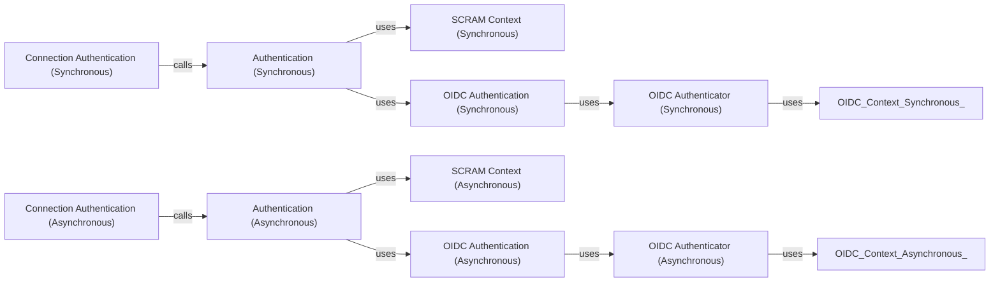

## Component Details

The Authentication component is responsible for handling the authentication process with MongoDB servers. It supports various authentication mechanisms, including SCRAM, Kerberos, X.509, PLAIN, and OIDC. The component selects the appropriate authentication mechanism based on the provided credentials and server requirements. It then performs the necessary handshake procedures to establish a secure connection. The authentication process is handled differently for synchronous and asynchronous connections, but the core logic remains the same. The component interacts with connection pools to authenticate connections before they are used for database operations.

### Authentication (Synchronous)
Handles the authentication process for synchronous connections. It selects the appropriate authentication mechanism and calls the corresponding authentication function.
- **Related Classes/Methods**: `pymongo.synchronous.auth:authenticate` (full file reference), `pymongo.synchronous.auth:_authenticate_scram` (full file reference), `pymongo.synchronous.auth:_authenticate_gssapi` (full file reference), `pymongo.synchronous.auth:_authenticate_plain` (full file reference), `pymongo.synchronous.auth:_authenticate_x509` (full file reference), `pymongo.synchronous.auth:_authenticate_default` (full file reference), `pymongo.synchronous.auth:_auth_key` (full file reference), `pymongo.synchronous.auth:_canonicalize_hostname` (full file reference)

### Authentication (Asynchronous)
Handles the authentication process for asynchronous connections, mirroring the functionality of the synchronous authentication module.
- **Related Classes/Methods**: `pymongo.asynchronous.auth:authenticate` (full file reference), `pymongo.asynchronous.auth:_authenticate_scram` (full file reference), `pymongo.asynchronous.auth:_authenticate_gssapi` (full file reference), `pymongo.asynchronous.auth:_authenticate_plain` (full file reference), `pymongo.asynchronous.auth:_authenticate_x509` (full file reference), `pymongo.asynchronous.auth:_authenticate_default` (full file reference), `pymongo.asynchronous.auth:_auth_key` (full file reference), `pymongo.asynchronous.auth:_canonicalize_hostname` (full file reference)

### SCRAM Context (Synchronous)
Manages the SCRAM authentication context for synchronous connections. It initializes the context and provides a method to speculate the command for authentication.
- **Related Classes/Methods**: `pymongo.synchronous.auth._ScramContext:__init__` (full file reference), `pymongo.synchronous.auth._ScramContext:speculate_command` (full file reference)

### SCRAM Context (Asynchronous)
Manages the SCRAM authentication context for asynchronous connections. It initializes the context and provides a method to speculate the command for authentication.
- **Related Classes/Methods**: `pymongo.asynchronous.auth._ScramContext:__init__` (full file reference), `pymongo.asynchronous.auth._ScramContext:speculate_command` (full file reference)

### OIDC Authentication (Synchronous)
Handles OIDC authentication for synchronous connections. It includes functions to get the appropriate authenticator and to perform the OIDC authentication flow.
- **Related Classes/Methods**: `pymongo.synchronous.auth_oidc:_get_authenticator` (49:75), `pymongo.synchronous.auth_oidc:_authenticate_oidc` (295:303)

### OIDC Authentication (Asynchronous)
Handles OIDC authentication for asynchronous connections. It includes functions to get the appropriate authenticator and to perform the OIDC authentication flow.
- **Related Classes/Methods**: `pymongo.asynchronous.auth_oidc:_get_authenticator` (49:75), `pymongo.asynchronous.auth_oidc:_authenticate_oidc` (297:305)

### OIDC Authenticator (Synchronous)
The OIDC authenticator class for synchronous connections. It handles the details of the OIDC authentication flow, including obtaining access tokens, constructing authentication commands, and running commands against the server.
- **Related Classes/Methods**: `pymongo.synchronous.auth_oidc._OIDCAuthenticator:reauthenticate` (93:100), `pymongo.synchronous.auth_oidc._OIDCAuthenticator:authenticate` (102:118), `pymongo.synchronous.auth_oidc._OIDCAuthenticator:get_spec_auth_cmd` (120:124), `pymongo.synchronous.auth_oidc._OIDCAuthenticator:_authenticate_machine` (126:138), `pymongo.synchronous.auth_oidc._OIDCAuthenticator:_authenticate_human` (140:171), `pymongo.synchronous.auth_oidc._OIDCAuthenticator:_get_access_token` (173:232), `pymongo.synchronous.auth_oidc._OIDCAuthenticator:_run_command` (234:240), `pymongo.synchronous.auth_oidc._OIDCAuthenticator:_sasl_continue_jwt` (255:266), `pymongo.synchronous.auth_oidc._OIDCAuthenticator:_sasl_start_jwt` (268:272), `pymongo.synchronous.auth_oidc._OIDCAuthenticator:_get_start_command` (274:282), `pymongo.synchronous.auth_oidc._OIDCAuthenticator:_get_continue_command` (284:292)

### OIDC Authenticator (Asynchronous)
The OIDC authenticator class for asynchronous connections. It handles the details of the OIDC authentication flow, including obtaining access tokens, constructing authentication commands, and running commands against the server.
- **Related Classes/Methods**: `pymongo.asynchronous.auth_oidc._OIDCAuthenticator:reauthenticate` (93:100), `pymongo.asynchronous.auth_oidc._OIDCAuthenticator:authenticate` (102:118), `pymongo.asynchronous.auth_oidc._OIDCAuthenticator:get_spec_auth_cmd` (120:124), `pymongo.asynchronous.auth_oidc._OIDCAuthenticator:_authenticate_machine` (126:138), `pymongo.asynchronous.auth_oidc._OIDCAuthenticator:_authenticate_human` (140:171), `pymongo.asynchronous.auth_oidc._OIDCAuthenticator:_get_access_token` (173:232), `pymongo.asynchronous.auth_oidc._OIDCAuthenticator:_run_command` (234:242), `pymongo.asynchronous.auth_oidc._OIDCAuthenticator:_sasl_continue_jwt` (257:268), `pymongo.asynchronous.auth_oidc._OIDCAuthenticator:_sasl_start_jwt` (270:274), `pymongo.asynchronous.auth_oidc._OIDCAuthenticator:_get_start_command` (276:284), `pymongo.asynchronous.auth_oidc._OIDCAuthenticator:_get_continue_command` (286:294)

### Connection Authentication (Synchronous)
Handles authentication at the connection level for synchronous connections.
- **Related Classes/Methods**: `pymongo.synchronous.pool.Connection:authenticate` (509:541)

### Connection Authentication (Asynchronous)
Handles authentication at the connection level for asynchronous connections.
- **Related Classes/Methods**: `pymongo.asynchronous.pool.AsyncConnection:authenticate` (509:541)