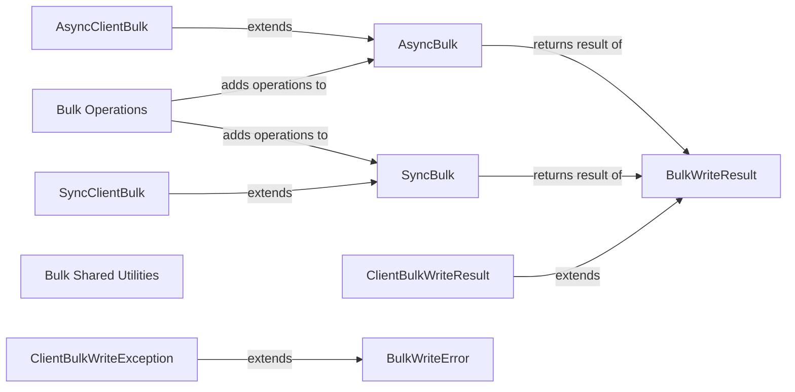

## Component Details

The BulkWrite component enables the execution of multiple write operations in a single batch, improving performance for scenarios involving large-scale data manipulation. It supports both ordered and unordered execution, and provides methods for adding insert, update, and delete operations. The component consists of abstract classes for synchronous and asynchronous operations, as well as client-side extensions. It interacts with other components such as Bulk Operations, BulkWriteResult, and BulkWriteError to manage the execution and results of bulk write operations.

### AsyncBulk
Implements asynchronous bulk write operations. It provides methods to add individual operations to a bulk request and then execute the entire batch asynchronously.
- **Related Classes/Methods**: `mongo-python-driver.pymongo.asynchronous.bulk._AsyncBulk:__init__` (86:119), `mongo-python-driver.pymongo.asynchronous.bulk._AsyncBulk:add_insert` (131:137), `mongo-python-driver.pymongo.asynchronous.bulk._AsyncBulk:add_update` (139:170), `mongo-python-driver.pymongo.asynchronous.bulk._AsyncBulk:add_replace` (172:195), `mongo-python-driver.pymongo.asynchronous.bulk._AsyncBulk:execute` (727:753)

### SyncBulk
Implements synchronous bulk write operations. It provides methods to add individual operations to a bulk request and then execute the entire batch synchronously.
- **Related Classes/Methods**: `mongo-python-driver.pymongo.synchronous.bulk._Bulk:__init__` (86:119), `mongo-python-driver.pymongo.synchronous.bulk._Bulk:add_insert` (131:137), `mongo-python-driver.pymongo.synchronous.bulk._Bulk:add_update` (139:170), `mongo-python-driver.pymongo.synchronous.bulk._Bulk:add_replace` (172:195), `mongo-python-driver.pymongo.synchronous.bulk._Bulk:execute` (725:751)

### AsyncClientBulk
Implements asynchronous client-side bulk write operations. It extends the AsyncBulk and includes additional logic for client-side operations, such as processing results from a cursor.
- **Related Classes/Methods**: `mongo-python-driver.pymongo.asynchronous.client_bulk._AsyncClientBulk:__init__` (89:118), `mongo-python-driver.pymongo.asynchronous.client_bulk._AsyncClientBulk:add_insert` (124:133), `mongo-python-driver.pymongo.asynchronous.client_bulk._AsyncClientBulk:add_update` (135:172), `mongo-python-driver.pymongo.asynchronous.client_bulk._AsyncClientBulk:add_replace` (174:203), `mongo-python-driver.pymongo.asynchronous.client_bulk._AsyncClientBulk:execute` (728:755)

### SyncClientBulk
Implements synchronous client-side bulk write operations. It extends the SyncBulk and includes additional logic for client-side operations, such as processing results from a cursor.
- **Related Classes/Methods**: `mongo-python-driver.pymongo.synchronous.client_bulk._ClientBulk:__init__` (89:118), `mongo-python-driver.pymongo.synchronous.client_bulk._ClientBulk:add_insert` (124:133), `mongo-python-driver.pymongo.synchronous.client_bulk._ClientBulk:add_update` (135:172), `mongo-python-driver.pymongo.synchronous.client_bulk._ClientBulk:add_replace` (174:203), `mongo-python-driver.pymongo.synchronous.client_bulk._ClientBulk:execute` (726:753)

### BulkWriteResult
Represents the result of a bulk write operation. It contains information about the number of documents inserted, updated, deleted, and matched, as well as any errors that occurred during the operation.
- **Related Classes/Methods**: `mongo-python-driver.pymongo.results.BulkWriteResult:__init__` (265:273), `mongo-python-driver.pymongo.results.BulkWriteResult:upserted_ids` (281:286)

### ClientBulkWriteResult
Represents the result of a client-side bulk write operation. It extends the BulkWriteResult and includes additional information specific to client-side operations.
- **Related Classes/Methods**: `mongo-python-driver.pymongo.results.ClientBulkWriteResult:__init__` (294:315), `mongo-python-driver.pymongo.results.ClientBulkWriteResult:_raise_if_not_verbose` (325:332), `mongo-python-driver.pymongo.results.ClientBulkWriteResult:insert_results` (340:347)

### BulkWriteError
Represents an error that occurred during a bulk write operation. It contains information about the error code, message, and index of the operation that failed.
- **Related Classes/Methods**: `mongo-python-driver.pymongo.errors.BulkWriteError:__init__` (292:293), `mongo-python-driver.pymongo.errors.BulkWriteError:timeout` (299:309)

### ClientBulkWriteException
Represents an exception that occurred during a client-side bulk write operation. It extends the BulkWriteError and includes additional information specific to client-side operations, such as the partial result of the operation.
- **Related Classes/Methods**: `mongo-python-driver.pymongo.errors.ClientBulkWriteException:__init__` (318:320), `mongo-python-driver.pymongo.errors.ClientBulkWriteException:partial_result` (353:365)

### Bulk Shared Utilities
Provides shared utility functions for bulk write operations, such as merging command documents and raising bulk write errors.
- **Related Classes/Methods**: `mongo-python-driver.pymongo._client_bulk_shared:_merge_command` (28:57), `mongo-python-driver.pymongo._client_bulk_shared:_throw_client_bulk_write_exception` (60:79), `mongo-python-driver.pymongo.bulk_shared:_merge_command` (72:113), `mongo-python-driver.pymongo.bulk_shared:_raise_bulk_write_error` (116:131)

### Bulk Operations
This component encapsulates the logic for performing bulk write operations (insert, update, delete, replace) against a MongoDB collection.
- **Related Classes/Methods**: `mongo-python-driver.pymongo.operations.InsertOne:_add_to_client_bulk` (113:122), `mongo-python-driver.pymongo.operations.DeleteOne:_add_to_bulk` (233:240), `mongo-python-driver.pymongo.operations.DeleteMany:_add_to_bulk` (294:301), `mongo-python-driver.pymongo.operations.ReplaceOne:_add_to_bulk` (387:396), `mongo-python-driver.pymongo.operations.UpdateOne:_add_to_bulk` (609:620)