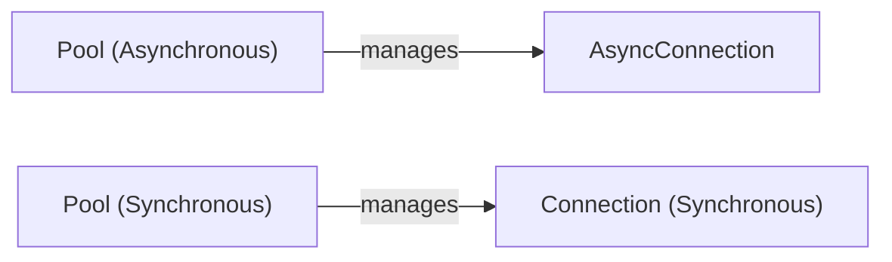

## Component Details

The connection pool manages a set of connections to MongoDB servers, providing connection reuse and reducing overhead. It supports both synchronous and asynchronous operations, connection monitoring, health checks, and automatic reconnection. The core components are the Pool (both synchronous and asynchronous), which manages the connections, and the Connection (both synchronous and asynchronous), which represents a single connection to the server. The Connection objects handle sending commands, receiving responses, authentication, and managing the connection lifecycle.

### AsyncConnection
The AsyncConnection class manages an asynchronous connection to a MongoDB server. It handles tasks such as sending commands, receiving responses, authentication, and closing the connection. It interacts with the Pool to get a socket and manages the connection lifecycle.
- **Related Classes/Methods**: `pymongo.asynchronous.pool.AsyncConnection:__init__` (137:194), `pymongo.asynchronous.pool.AsyncConnection:apply_timeout` (203:232), `pymongo.asynchronous.pool.AsyncConnection:unpin` (242:247), `pymongo.asynchronous.pool.AsyncConnection:hello` (258:259), `pymongo.asynchronous.pool.AsyncConnection:_hello` (261:344), `pymongo.asynchronous.pool.AsyncConnection:_next_reply` (346:352), `pymongo.asynchronous.pool.AsyncConnection:command` (355:442), `pymongo.asynchronous.pool.AsyncConnection:send_message` (444:459), `pymongo.asynchronous.pool.AsyncConnection:receive_message` (461:470), `pymongo.asynchronous.pool.AsyncConnection:_raise_if_not_writable` (472:478), `pymongo.asynchronous.pool.AsyncConnection:unack_write` (480:489), `pymongo.asynchronous.pool.AsyncConnection:write_command` (491:507), `pymongo.asynchronous.pool.AsyncConnection:authenticate` (509:541), `pymongo.asynchronous.pool.AsyncConnection:validate_session` (543:554), `pymongo.asynchronous.pool.AsyncConnection:close_conn` (556:575), `pymongo.asynchronous.pool.AsyncConnection:_close_conn` (577:588), `pymongo.asynchronous.pool.AsyncConnection:conn_closed` (590:595), `pymongo.asynchronous.pool.AsyncConnection:add_server_api` (607:610), `pymongo.asynchronous.pool.AsyncConnection:_raise_connection_failure` (622:648)

### Pool (Asynchronous)
The Pool class manages a pool of asynchronous connections to a MongoDB server. It handles tasks such as creating new connections, checking out connections for use, checking connections back in, and closing connections. It interacts with AsyncConnection to manage individual connections and provides connection pooling functionality.
- **Related Classes/Methods**: `pymongo.asynchronous.pool.Pool:__init__` (713:797), `pymongo.asynchronous.pool.Pool:ready` (799:814), `pymongo.asynchronous.pool.Pool:_reset` (820:911), `pymongo.asynchronous.pool.Pool:reset` (922:927), `pymongo.asynchronous.pool.Pool:reset_without_pause` (929:930), `pymongo.asynchronous.pool.Pool:close` (932:933), `pymongo.asynchronous.pool.Pool:stale_generation` (935:936), `pymongo.asynchronous.pool.Pool:remove_stale_sockets` (938:1005), `pymongo.asynchronous.pool.Pool:connect` (1007:1088), `pymongo.asynchronous.pool.Pool:checkout` (1091:1167), `pymongo.asynchronous.pool.Pool:_raise_if_not_ready` (1169:1193), `pymongo.asynchronous.pool.Pool:_get_conn` (1195:1322), `pymongo.asynchronous.pool.Pool:checkin` (1324:1397), `pymongo.asynchronous.pool.Pool:_perished` (1399:1433), `pymongo.asynchronous.pool.Pool:_raise_wait_queue_timeout` (1435:1472)

### Connection (Synchronous)
The Connection class manages a synchronous connection to a MongoDB server. It handles tasks such as sending commands, receiving responses, authentication, and closing the connection. It interacts with the Pool to get a socket and manages the connection lifecycle.
- **Related Classes/Methods**: `pymongo.synchronous.pool.Connection:__init__` (137:194), `pymongo.synchronous.pool.Connection:apply_timeout` (203:232), `pymongo.synchronous.pool.Connection:unpin` (242:247), `pymongo.synchronous.pool.Connection:hello` (258:259), `pymongo.synchronous.pool.Connection:_hello` (261:344), `pymongo.synchronous.pool.Connection:_next_reply` (346:352), `pymongo.synchronous.pool.Connection:command` (355:442), `pymongo.synchronous.pool.Connection:send_message` (444:459), `pymongo.synchronous.pool.Connection:receive_message` (461:470), `pymongo.synchronous.pool.Connection:_raise_if_not_writable` (472:478), `pymongo.synchronous.pool.Connection:unack_write` (480:489), `pymongo.synchronous.pool.Connection:write_command` (491:507), `pymongo.synchronous.pool.Connection:authenticate` (509:541), `pymongo.synchronous.pool.Connection:validate_session` (543:552), `pymongo.synchronous.pool.Connection:close_conn` (554:573), `pymongo.synchronous.pool.Connection:_close_conn` (575:586), `pymongo.synchronous.pool.Connection:conn_closed` (588:593), `pymongo.synchronous.pool.Connection:add_server_api` (605:608), `pymongo.synchronous.pool.Connection:_raise_connection_failure` (620:646)

### Pool (Synchronous)
The Pool class manages a pool of synchronous connections to a MongoDB server. It handles tasks such as creating new connections, checking out connections for use, checking connections back in, and closing connections. It interacts with Connection to manage individual connections and provides connection pooling functionality.
- **Related Classes/Methods**: `pymongo.synchronous.pool.Pool:__init__` (711:795), `pymongo.synchronous.pool.Pool:ready` (797:812), `pymongo.synchronous.pool.Pool:_reset` (818:909), `pymongo.synchronous.pool.Pool:reset` (920:923), `pymongo.synchronous.pool.Pool:reset_without_pause` (925:926), `pymongo.synchronous.pool.Pool:close` (928:929), `pymongo.synchronous.pool.Pool:stale_generation` (931:932), `pymongo.synchronous.pool.Pool:remove_stale_sockets` (934:1001), `pymongo.synchronous.pool.Pool:connect` (1003:1084), `pymongo.synchronous.pool.Pool:checkout` (1087:1163), `pymongo.synchronous.pool.Pool:_raise_if_not_ready` (1165:1189), `pymongo.synchronous.pool.Pool:_get_conn` (1191:1318), `pymongo.synchronous.pool.Pool:checkin` (1320:1393), `pymongo.synchronous.pool.Pool:_perished` (1395:1429), `pymongo.synchronous.pool.Pool:_raise_wait_queue_timeout` (1431:1468)