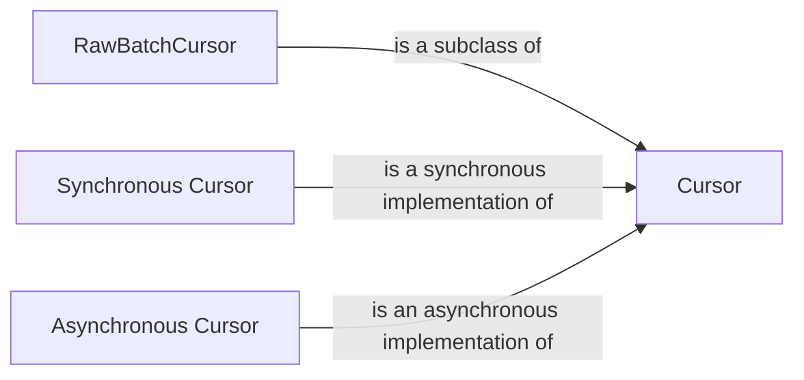

## Component Details

The Cursor component in PyMongo is responsible for efficiently retrieving query results from MongoDB. It provides functionalities for iterating through the results, applying query modifiers like limit, skip, and sort, and handling batching and connection management. The Cursor component has both synchronous and asynchronous implementations to support different application needs.

### Cursor
The base class for both synchronous and asynchronous cursors. It provides the core functionality for iterating through query results, applying modifiers like limit, skip, sort, and handling options like collation and hints. It manages the connection to the database, sends messages to retrieve batches of results, and handles cursor finalization.
- **Related Classes/Methods**: `pymongo.synchronous.cursor.Cursor` (92:1321), `pymongo.asynchronous.cursor.AsyncCursor` (92:1323)

### RawBatchCursor
The RawBatchCursor class (and its asynchronous counterpart) are subclasses of Cursor that handle raw batches of data. They are responsible for unpacking the response from the database and providing access to the raw data. They inherit the cursor management and modification functionalities from the base Cursor class.
- **Related Classes/Methods**: `pymongo.synchronous.cursor.RawBatchCursor` (1324:1365), `pymongo.asynchronous.cursor.AsyncRawBatchCursor` (1326:1369)

### Synchronous Cursor
The synchronous implementation of the Cursor, providing blocking operations for retrieving query results. It inherits from the base Cursor class and implements the necessary methods for synchronous iteration and data retrieval.
- **Related Classes/Methods**: `pymongo.synchronous.cursor.Cursor` (92:1321)

### Asynchronous Cursor
The asynchronous implementation of the Cursor, providing non-blocking operations for retrieving query results. It inherits from the base Cursor class and uses asyncio for asynchronous iteration and data retrieval.
- **Related Classes/Methods**: `pymongo.asynchronous.cursor.AsyncCursor` (92:1323)