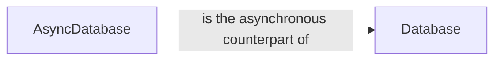

## Component Details

The Database component in PyMongo provides an interface for interacting with a MongoDB database. It offers methods for performing various database operations, such as creating and managing collections, executing commands, and handling database-level configurations. The component supports both synchronous and asynchronous operations through the `Database` and `AsyncDatabase` classes, respectively. These classes provide a consistent API for interacting with the database, regardless of the execution model.

### Database
Represents a synchronous MongoDB database interface, providing methods for interacting with the database, such as creating, dropping, listing, and validating collections, as well as executing commands.
- **Related Classes/Methods**: `pymongo.synchronous.database.Database:__init__` (62:137), `pymongo.synchronous.database.Database:with_options` (150:157), `pymongo.synchronous.database.Database:__getattr__` (229:241), `pymongo.synchronous.database.Database:__getitem__` (243:250), `pymongo.synchronous.database.Database:get_collection` (252:304), `pymongo.synchronous.database.Database:watch` (348:477), `pymongo.synchronous.database.Database:create_collection` (480:633), `pymongo.synchronous.database.Database:aggregate` (635:712), `pymongo.synchronous.database.Database:command` (784:796), `pymongo.synchronous.database.Database:cursor_command` (943:1043), `pymongo.synchronous.database.Database:_retryable_read_command` (1045:1067), `pymongo.synchronous.database.Database:_list_collections` (1069:1096), `pymongo.synchronous.database.Database:_list_collections_helper` (1098:1140), `pymongo.synchronous.database.Database:list_collections` (1142:1168), `pymongo.synchronous.database.Database:_list_collection_names` (1170:1192), `pymongo.synchronous.database.Database:list_collection_names` (1194:1226), `pymongo.synchronous.database.Database:_drop_helper` (1228:1243), `pymongo.synchronous.database.Database:drop_collection` (1246:1321), `pymongo.synchronous.database.Database:validate_collection` (1323:1405)

### AsyncDatabase
Represents an asynchronous MongoDB database interface, providing methods for interacting with the database in an asynchronous manner, such as creating, dropping, listing, and validating collections, as well as executing commands.
- **Related Classes/Methods**: `pymongo.asynchronous.database.AsyncDatabase:__init__` (62:137), `pymongo.asynchronous.database.AsyncDatabase:with_options` (150:157), `pymongo.asynchronous.database.AsyncDatabase:__getattr__` (229:241), `pymongo.asynchronous.database.AsyncDatabase:__getitem__` (243:250), `pymongo.asynchronous.database.AsyncDatabase:get_collection` (252:304), `pymongo.asynchronous.database.AsyncDatabase:watch` (348:477), `pymongo.asynchronous.database.AsyncDatabase:create_collection` (480:633), `pymongo.asynchronous.database.AsyncDatabase:aggregate` (635:712), `pymongo.asynchronous.database.AsyncDatabase:command` (784:796), `pymongo.asynchronous.database.AsyncDatabase:cursor_command` (945:1047), `pymongo.asynchronous.database.AsyncDatabase:_retryable_read_command` (1049:1071), `pymongo.asynchronous.database.AsyncDatabase:_list_collections` (1073:1100), `pymongo.asynchronous.database.AsyncDatabase:_list_collections_helper` (1102:1146), `pymongo.asynchronous.database.AsyncDatabase:list_collections` (1148:1174), `pymongo.asynchronous.database.AsyncDatabase:_list_collection_names` (1176:1199), `pymongo.asynchronous.database.AsyncDatabase:list_collection_names` (1201:1233), `pymongo.asynchronous.database.AsyncDatabase:_drop_helper` (1235:1250), `pymongo.asynchronous.database.AsyncDatabase:drop_collection` (1253:1328), `pymongo.asynchronous.database.AsyncDatabase:validate_collection` (1330:1412)