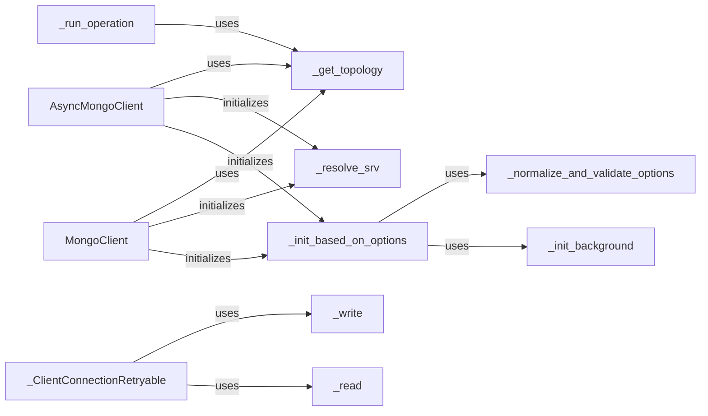

## Component Details

The MongoClient component serves as the primary entry point for interacting with a MongoDB cluster. It manages connections, authentication, and database operations, providing methods to access databases and collections. It supports both synchronous and asynchronous operations. The client handles the initial connection setup, including resolving SRV records, normalizing options, and initializing background processes for monitoring the cluster topology. Once initialized, it provides methods for executing read and write operations, managing sessions, and handling retries. The synchronous and asynchronous versions provide similar functionalities but differ in their execution models.

### MongoClient
The MongoClient class provides a synchronous interface for interacting with a MongoDB database. It manages connections, executes operations, and handles sessions for synchronous operations.
- **Related Classes/Methods**: `pymongo.synchronous.mongo_client.MongoClient` (169:2544)

### AsyncMongoClient
The AsyncMongoClient class provides an asynchronous interface for interacting with a MongoDB database. It handles connection management, operation execution, and session management for asynchronous operations.
- **Related Classes/Methods**: `pymongo.asynchronous.mongo_client.AsyncMongoClient` (172:2554)

### _run_operation
The _run_operation method is responsible for executing a given operation against the MongoDB server. It handles connection acquisition (either read or write connection), retries, and session management.
- **Related Classes/Methods**: `pymongo.asynchronous.mongo_client.AsyncMongoClient:_run_operation` (1872:1928), `pymongo.synchronous.mongo_client.MongoClient:_run_operation` (1868:1924)

### _get_topology
The _get_topology method retrieves the current topology of the MongoDB cluster. The topology describes the state of the cluster, including the primary, secondaries, and arbiters.
- **Related Classes/Methods**: `pymongo.asynchronous.mongo_client.AsyncMongoClient:_get_topology` (1726:1747), `pymongo.synchronous.mongo_client.MongoClient:_get_topology` (1722:1743)

### _ClientConnectionRetryable
The _ClientConnectionRetryable class is responsible for handling retryable operations. It checks if an operation is eligible for retry and executes read or write operations.
- **Related Classes/Methods**: `pymongo.asynchronous.mongo_client._ClientConnectionRetryable` (2687:2903), `pymongo.synchronous.mongo_client._ClientConnectionRetryable` (2675:2891)

### _init_based_on_options
Initializes the MongoClient based on the provided options, normalizing and validating them, and initializing background processes.
- **Related Classes/Methods**: `pymongo.synchronous.mongo_client.MongoClient:_init_based_on_options` (955:982), `pymongo.asynchronous.mongo_client.AsyncMongoClient:_init_based_on_options` (955:982)

### _resolve_srv
Resolves the MongoDB SRV URI to discover the cluster's topology.
- **Related Classes/Methods**: `pymongo.synchronous.mongo_client.MongoClient:_resolve_srv` (886:953), `pymongo.asynchronous.mongo_client.AsyncMongoClient:_resolve_srv` (886:953)

### _write
Executes a write operation against the MongoDB server.
- **Related Classes/Methods**: `pymongo.synchronous.mongo_client.MongoClient:_write` (full file reference)

### _read
Executes a read operation against the MongoDB server.
- **Related Classes/Methods**: `pymongo.synchronous.mongo_client.MongoClient:_read` (full file reference)