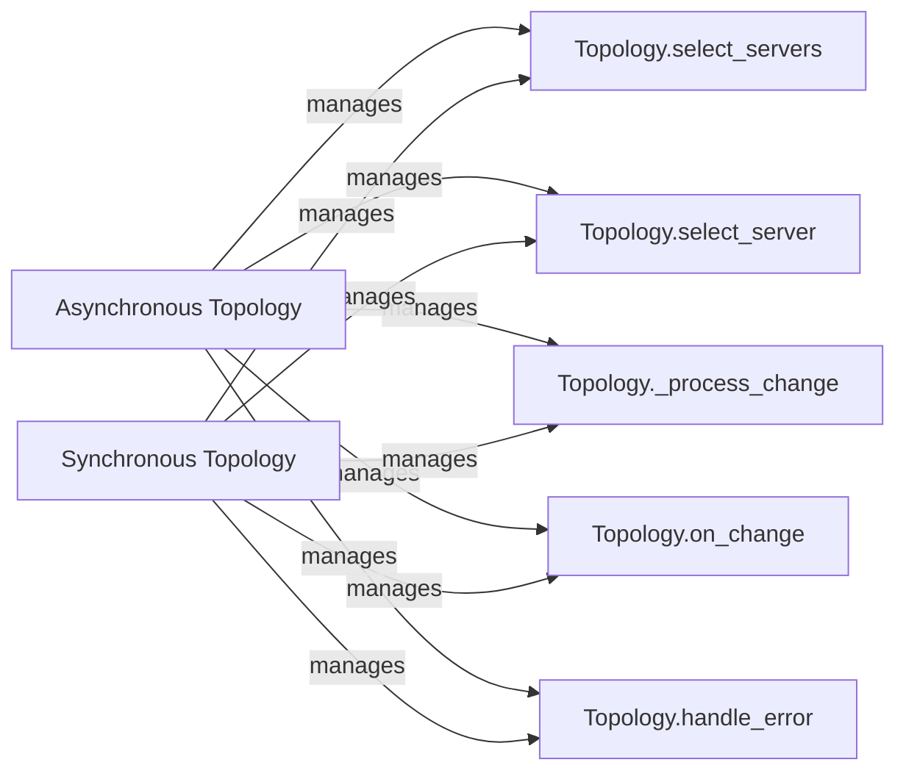

## Component Details

The Topology component is responsible for managing the state of a MongoDB cluster, including discovering servers, monitoring their health, and selecting suitable servers for database operations. It maintains an up-to-date view of the cluster's configuration and server status, adapting to changes in real-time. The topology supports both synchronous and asynchronous operations, providing flexibility for different application needs. It handles server selection based on criteria such as server type (primary, secondary), latency, and availability, ensuring that operations are routed to the most appropriate servers.

### Asynchronous Topology
The Asynchronous Topology component manages the asynchronous monitoring and selection of servers in a MongoDB cluster. It uses asynchronous operations to handle server discovery, health monitoring, and selection of appropriate servers for operations, providing non-blocking behavior.
- **Related Classes/Methods**: `pymongo.asynchronous.topology.Topology` (104:1075)

### Synchronous Topology
The Synchronous Topology component manages the synchronous monitoring and selection of servers in a MongoDB cluster. It uses synchronous operations to handle server discovery, health monitoring, and selection of appropriate servers for operations, providing blocking behavior.
- **Related Classes/Methods**: `pymongo.synchronous.topology.Topology` (104:1073)

### Topology.select_servers
The `select_servers` method selects suitable servers from the topology based on the provided server selection criteria and timeout. It orchestrates the server selection process, potentially initiating server discovery and monitoring if needed. It returns a list of servers that match the specified criteria.
- **Related Classes/Methods**: `pymongo.asynchronous.topology.Topology:select_servers` (261:300), `pymongo.synchronous.topology.Topology:select_servers` (261:300)

### Topology.select_server
The `select_server` method selects a single suitable server from the topology. It is a lower-level method compared to `select_servers`, focusing on selecting one server based on immediate availability and health. It returns a single server instance or raises an exception if no suitable server is found.
- **Related Classes/Methods**: `pymongo.asynchronous.topology.Topology:select_server` (399:431), `pymongo.synchronous.topology.Topology:select_server` (399:431)

### Topology._process_change
The `_process_change` method processes changes in the topology's view of the cluster, such as server status updates or configuration changes. It updates the internal state of the topology to reflect the new information, ensuring that the topology maintains an accurate representation of the cluster's state.
- **Related Classes/Methods**: `pymongo.asynchronous.topology.Topology:_process_change` (466:533), `pymongo.synchronous.topology.Topology:_process_change` (466:533)

### Topology.on_change
The `on_change` method is a callback that is triggered when the topology's state changes. It allows external components to react to topology changes, such as server availability or role changes. This enables other parts of the system to adapt to changes in the cluster's configuration.
- **Related Classes/Methods**: `pymongo.asynchronous.topology.Topology:on_change` (535:558), `pymongo.synchronous.topology.Topology:on_change` (535:558)

### Topology.handle_error
The `handle_error` method handles errors encountered during server monitoring or selection. It determines the appropriate action to take based on the error type and severity, such as retrying the operation or updating the topology's state. This ensures that the topology can gracefully handle errors and maintain a consistent view of the cluster.
- **Related Classes/Methods**: `pymongo.asynchronous.topology.Topology:handle_error` (906:913), `pymongo.synchronous.topology.Topology:handle_error` (904:911)