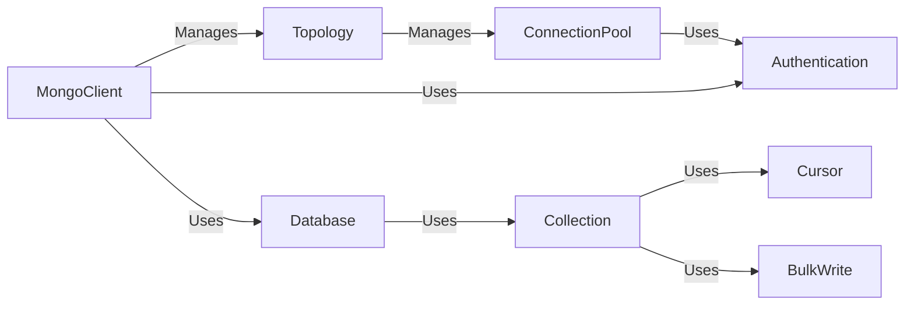

## Component Details

The mongo-python-driver provides a Python interface for interacting with MongoDB databases. It offers a comprehensive set of features for connecting to MongoDB clusters, managing databases and collections, performing CRUD operations, and handling authentication and security. The driver supports both synchronous and asynchronous operations, allowing developers to choose the programming model that best suits their needs. It also provides advanced features such as client-side encryption, client sessions, and monitoring, enabling developers to build robust and scalable applications that leverage the full capabilities of MongoDB.

### MongoClient
The MongoClient component serves as the primary entry point for interacting with a MongoDB cluster. It manages connections, authentication, and database operations, providing methods to access databases and collections. It supports both synchronous and asynchronous operations.
- **Related Classes/Methods**: `pymongo.asynchronous.mongo_client.AsyncMongoClient` (172:2554), `pymongo.synchronous.mongo_client.MongoClient` (169:2544)

### Database
The Database component represents a MongoDB database and provides methods for accessing collections, running commands, and managing database-level operations. It supports both synchronous and asynchronous operations.
- **Related Classes/Methods**: `pymongo.asynchronous.database.AsyncDatabase` (61:1454), `pymongo.synchronous.database.Database` (61:1447)

### Collection
The Collection component represents a MongoDB collection and provides methods for performing CRUD operations, creating indexes, and managing collection-level settings. It supports both synchronous and asynchronous operations.
- **Related Classes/Methods**: `pymongo.asynchronous.collection.AsyncCollection` (138:3617), `pymongo.synchronous.collection.Collection` (137:3610)

### Cursor
The Cursor component facilitates the retrieval of query results from MongoDB. It supports various operations such as limiting, skipping, sorting, and batching, and provides methods for iterating through the results. It supports both synchronous and asynchronous operations.
- **Related Classes/Methods**: `pymongo.asynchronous.cursor.AsyncCursor` (92:1323), `pymongo.synchronous.cursor.Cursor` (92:1321)

### BulkWrite
The BulkWrite component enables the execution of multiple write operations in a single batch, improving performance for scenarios involving large-scale data manipulation. It supports both ordered and unordered execution, and provides methods for adding insert, update, and delete operations. It supports both synchronous and asynchronous operations.
- **Related Classes/Methods**: `pymongo.asynchronous.bulk._AsyncBulk` (83:753), `pymongo.synchronous.bulk._Bulk` (83:751), `pymongo.asynchronous.client_bulk._AsyncClientBulk` (86:755), `pymongo.synchronous.client_bulk._ClientBulk` (86:753)

### Topology
The Topology component manages the state of the MongoDB cluster, including server discovery, monitoring, and selection. It maintains information about the available servers and their roles, and provides methods for selecting suitable servers for read and write operations. It supports both synchronous and asynchronous operations.
- **Related Classes/Methods**: `pymongo.asynchronous.topology.Topology` (104:1075), `pymongo.synchronous.topology.Topology` (104:1073)

### ConnectionPool
The ConnectionPool component manages a pool of connections to MongoDB servers, optimizing connection reuse and reducing connection overhead. It supports connection monitoring, health checks, and automatic reconnection. It supports both synchronous and asynchronous operations.
- **Related Classes/Methods**: `pymongo.asynchronous.pool.Pool` (712:1480), `pymongo.synchronous.pool.Pool` (710:1476)

### Authentication
The Authentication component handles the authentication process with MongoDB servers, supporting various authentication mechanisms such as SCRAM, Kerberos, and X.509. It manages credentials and performs the necessary handshake procedures. It supports both synchronous and asynchronous operations.
- **Related Classes/Methods**: `pymongo.asynchronous.auth` (full file reference), `pymongo.synchronous.auth` (full file reference)