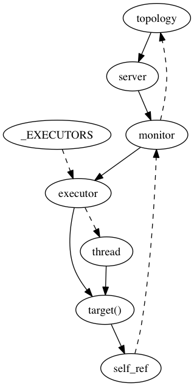

Periodic Executors
==================

.. currentmodule:: pymongo

PyMongo implements a :class:`~periodic_executor.PeriodicExecutor` for two
purposes: as the background thread for :class:`~monitor.Monitor`, and to
regularly check if there are `OP_KILL_CURSORS` messages that must be sent to the server.

Monitoring
----------

For each server in the topology, :class:`~topology.Topology` launches a
monitor thread. This thread must not prevent the topology from being freed,
so it weakrefs the topology. Furthermore, it uses a weakref callback to close
itself promptly when the topology is freed.

Solid lines represent strong references, dashed lines weak ones:

.. generated with graphviz from periodic-executor-refs.dot

See `Stopping Executors`_ below for an explanation of ``_EXECUTORS``.

Killing Cursors
---------------

An incompletely iterated :class:`~cursor.Cursor` on the client represents an
open cursor object on the server. In code like this, we lose a reference to
the cursor before finishing iteration::

    for doc in collection.find():
        raise Exception()

We try to send an `OP_KILL_CURSORS` to the server to tell it to clean up the
server-side cursor. But we must not take any locks directly from the cursor's
destructor (see `PYTHON-799 <https://jira.mongodb.org/browse/PYTHON-799>`_),
so we cannot safely use the PyMongo data structures required to send a message.
The solution is to add the cursor's id to an array on the
:class:`~mongo_client.MongoClient` without taking any locks.

Each client has a :class:`~periodic_executor.PeriodicExecutor` devoted to
checking the array for cursor ids. Any it sees are the result of cursors that
were freed while the server-side cursor was still open. The executor can safely
take the locks it needs in order to send the `OP_KILL_CURSORS` message.

Stopping Executors
------------------

Just as :class:`~cursor.Cursor` must not take any locks from its destructor,
neither can :class:`~mongo_client.MongoClient` and :class:`~topology.Topology`.
Thus, although the client calls :meth:`close` on its kill-cursors thread, and
the topology calls :meth:`close` on all its monitor threads, the :meth:`close`
method cannot actually call :meth:`wake` on the executor, since :meth:`wake`
takes a lock.

Instead, executors wake very frequently to check if ``self.close`` is set,
and if so they exit.

A thread can log spurious errors if it wakes late in the Python interpreter's
shutdown sequence, so we try to join threads before then. Each periodic
executor (either a monitor or a kill-cursors thread) adds a weakref to itself
to a set called ``_EXECUTORS``, in the ``periodic_executor`` module.

An `exit handler`_ runs on shutdown and tells all executors to stop, then
tries (with a short timeout) to join all executor threads.

.. _exit handler: https://docs.python.org/2/library/atexit.html
